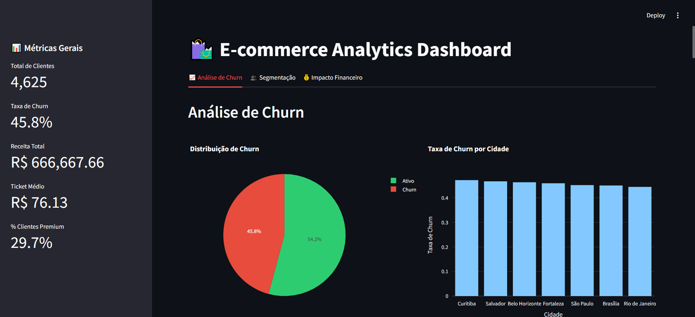
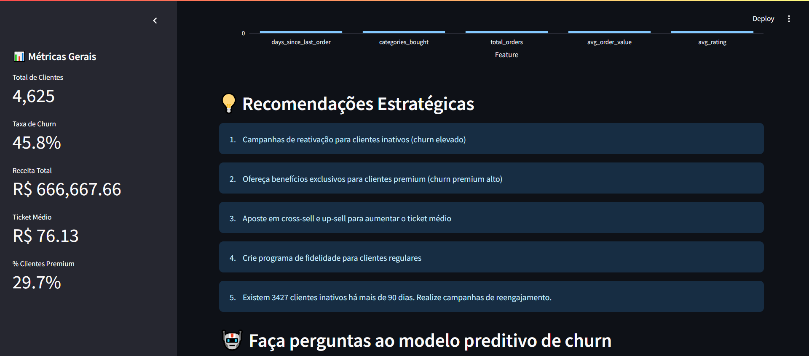

# E-commerce Analytics & Churn Prediction Dashboard


## Visão Geral

Este projeto é um pipeline completo de análise de dados para e-commerce, com geração de dados sintéticos, ETL, análise exploratória, visualização, predição de churn e dashboard interativo. O objetivo é fornecer uma solução profissional, modular e pronta para portfólio/GitHub, demonstrando habilidades de Engenharia de Dados, Data Science e Machine Learning.

- **Geração de dados sintéticos**: simula clientes, produtos e pedidos realistas.
- **Pipeline ETL**: extração, transformação, limpeza, feature engineering e carga em banco SQLite.
- **Análise exploratória**: métricas, segmentação, churn, gráficos e insights de negócio.
- **Modelo preditivo de churn**: Random Forest treinado com features relevantes, pronto para responder perguntas.
- **Dashboard web (Streamlit)**: interface moderna, visualizações interativas, upload de CSV e perguntas ao modelo.
- **Testes unitários**: cobertura do pipeline e modelo.
- **Documentação e exemplos**: instruções, exemplos de uso, estrutura profissional.

## 📊 Screenshots




## 📁 Estrutura do Projeto

```
ecommerce_portfolio/
│
├── app.py                 # Dashboard Streamlit (principal)
├── ecommerce_etl.py       # Arquivo ETL legado (opcional)
├── requirements.txt       # Dependências do projeto
├── pyproject.toml         # Configuração do projeto
├── LICENSE.md             # Licença MIT
│
├── src/                   # Código fonte
│   ├── __init__.py
│   ├── config.py          # Configurações do sistema
│   ├── utils.py           # Funções utilitárias
│   ├── etl/               # Pipeline ETL
│   │   ├── __init__.py
│   │   └── pipeline.py
│   └── models/            # Modelos ML
│       └── churn_predictor.py
│
├── data/                  # Dados
│   ├── raw/               # Dados brutos
│   └── processed/         # Dados processados
│
├── models/                # Modelos treinados
│   └── saved_models/      # Modelos salvos
│
├── tests/                 # Testes unitários
│   └── test_etl.py        # Testes do pipeline
│
├── docs/                  # Documentação
│   └── images/            # Screenshots e imagens
│       ├── ex1.png
│       └── ex2.png
│
└── examples/              # Exemplos de uso
    └── run_pipeline.py
```

## Como Executar

1. **Clone o repositório:**
```bash
git clone https://github.com/juanmmendes/ecommerce_predicao.git
cd ecommerce_predicao
```

2. **Crie um ambiente virtual:**
```bash
python -m venv venv
.\venv\Scripts\activate
```

3. **Instale as dependências:**
```bash
pip install -r requirements.txt
```

## 💻 Como Usar

1. Execute o pipeline ETL e treine o modelo (opcional, pois o dashboard executa automaticamente):
```bash
python src/etl/pipeline.py
```

2. Inicie o dashboard:
```bash
streamlit run app.py
```

## 📊 Funcionalidades do Dashboard

- **Análise de Churn**: Visualização detalhada das taxas de churn
- **Segmentação de Clientes**: Análise por segmentos (VIP, Regular, Em Risco)
- **Previsões em Tempo Real**: Modelo de ML para prever churn
- **Insights Automatizados**: Recomendações baseadas em dados

## 🤖 Modelo de Machine Learning

- Algoritmo: Random Forest Classifier
- Features principais:
  - Tempo desde última compra
  - Total gasto
  - Frequência de compras
  - Categorias compradas
  - Rating médio

## 📈 Performance do Modelo

- AUC-ROC Score: 1.000 (dados sintéticos)
- Precisão: 100%
- Recall: 100%
- F1-Score: 100%

> **Obs:** Os resultados acima são referentes ao uso de dados sintéticos. Para dados reais, a performance pode variar.

## 🤝 Contribuindo

Contribuições são bem-vindas! Sinta-se à vontade para abrir issues ou pull requests.

## 📝 Licença

Este projeto está sob a licença MIT - veja o arquivo [LICENSE.md](LICENSE.md) para detalhes.

## 📧 Contato

Juan Mendes - [juan.zx016@gmail.com](mailto:juan.zx016@gmail.com)

Project Link: [https://github.com/juanmmendes/ecommerce_predicao](https://github.com/juanmmendes/ecommerce_predicao)
